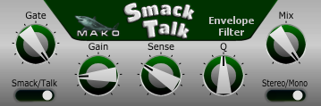

# Mako SmackTalk
* A demo JUCE VST Envelope Filter
* Tested on Windows only.
* Written in Visual C++ 2022.
* Written for new programmers, not complicated.
* Version: 1.00
* Posted: June 17, 2024

VERSION
------------------------------------------------------------------
1.00 - Initial release.

DISCLAIMER
------------------------------------------------------------------  
This VST was written in a very simple way. Just simple code for
people who are not programmers but want to dabble in the magic of JUCE VSTs.

If you are new to JUCE code, the Mako Thump VST may be a better
starting place. Or be brave and try this.
       
SUMMARY
------------------------------------------------------------------
A Juce/C++ VST3 written to create two distinct envelope filter sounds for guitar.

# THEORY OF OPERATION 
SMACK EFFECT  
This effect takes the incoming signal and sends it thru a SINE function. When multiplied
this creates higher order harmonics similar to a synthesizer. The effect is touch sensitive and can be very fun
for low note bass lines.  

The SENSE control sets when and how hard the effect is applied. You want to adjust it to where the effect is just starting to work.
After that, the effect will become harsh because of the amount of higher harmonics added.

TALK EFFECT  
This is a typical Envelope Filter type effect. It creates a touch sensitive Wah effect. It does this by adjusting a
filter based on how loud the signal is. How loud the instrument is being played. 

The SENSE control sets when and what frequencies to apply the effect.

The Q control adjusts the Q (width) of the filter. More Q = more Wah sound. Q also adds some volume.

Between the SENSE and Q controls you have a very wide range of effect. A MIX control was also added, but should never really be needed.

# JUCE ADDITIONS  
This VST uses a predrawn PNG image to make it look fancy. The default Slider controls have also been customized using the OVERRIDE functions.
The new Sliders have a chickenhead style knob drawn in code in our custom LOOKANDFEEL class (PluginEditor.h).
